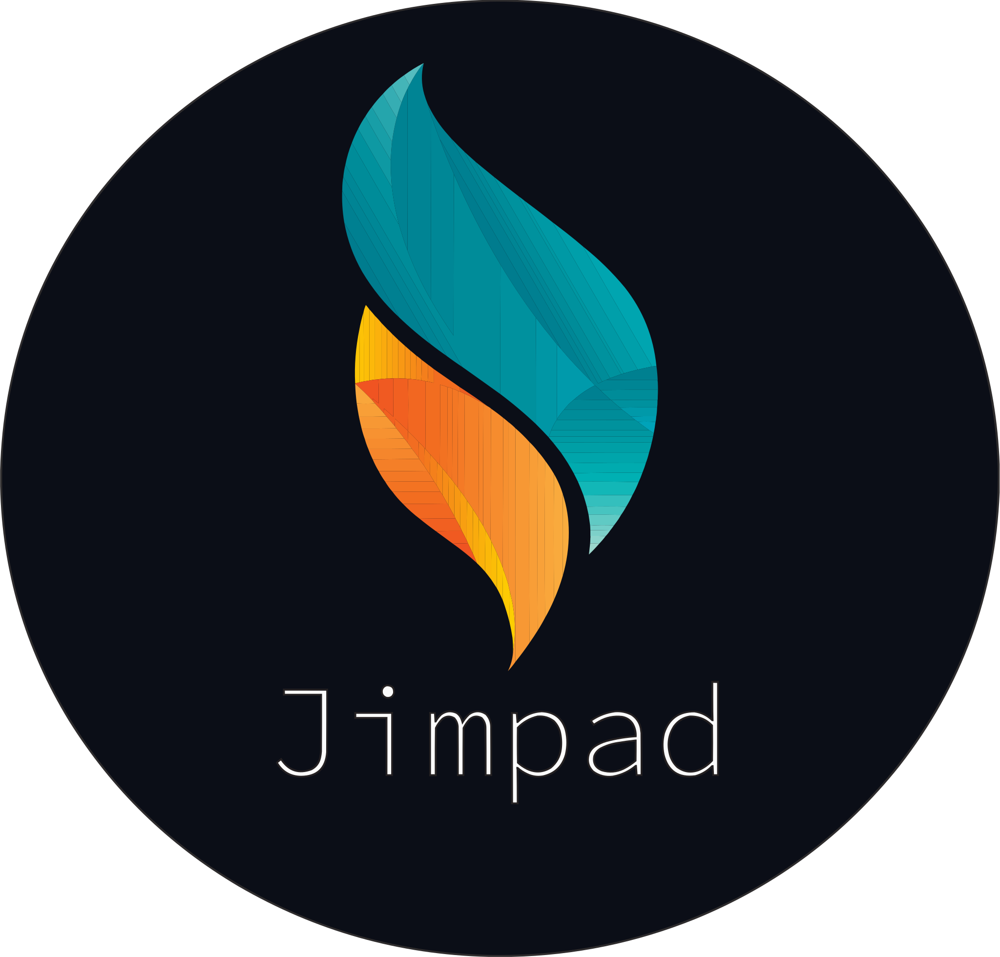

<!-- Improved compatibility of back to top link: See: https://github.com/othneildrew/Best-README-Template/pull/73 -->

<!--
*** Thanks for checking out the Best-README-Template. If you have a suggestion
*** that would make this better, please fork the repo and create a pull request
*** or simply open an issue with the tag "enhancement".
*** Don't forget to give the project a star!
*** Thanks again! Now go create something AMAZING! :D
-->

<!-- PROJECT SHIELDS -->
<!--
*** I'm using markdown "reference style" links for readability.
*** Reference links are enclosed in brackets [ ] instead of parentheses ( ).
*** See the bottom of this document for the declaration of the reference variables
*** for contributors-url, forks-url, etc. This is an optional, concise syntax you may use.
*** https://www.markdownguide.org/basic-syntax/#reference-style-links
-->
<!-- PROJECT LOGO -->

[![Contributors][contributors-shield]][contributors-url]
[![Stargazers][stars-shield]][stars-url]
[![LinkedIn][linkedin-shield]][linkedin-url]
[![MIT License][license-shield]][license-url]

  

    Powered by Netlify   
      
    <a href="https://github.com/Jimpad/jimpad"><strong>Explore the docs »</strong></a>
  

<!-- INTRODUCTORY -->

 
  <h1>Introductory</h1>
  
The digital resume provides an employer with information regarding a job candidate's professional experience, education and job qualifications and is meant to be read by a computer program instead of by a human being.

<!-- ABOUT THE PROJECT -->
<h1>About The Project</h1>

<!-- BUILT WITH -->
<h1>Built With</h1>

- [![Bootstrap][bootstrap.com]][bootstrap-url]
- [![React][react.js]][react-url]

<!-- ROADMAP -->
<h1>Roadmap</h1>
<table>
  <tr>
    <th>Feature</th>
    <th>Delivered</th>
    <th>In Progress</th>
  </tr>
  <tr>
    <td>Hero Landing Headline</td>
    <td>
    </img>
    </td>
    <td></td>
  </tr>
  <tr>
    <td>About</td>
    <td>
    </img>
    </td>
    <td></td>
  </tr>
  <tr>
    <td>Slider with Photo Descriptions</td>
    <td>
    </img>
    </td>
    <td></td>
  </tr>
  <tr>
    <td>Languages & Frameworks</td>
    <td>
    </img>
    </td>
    <td></td>
  </tr>
  <tr>
    <td>Technology Diagrams</td>
    <td>
    </img>
    </td>
    <td></td>
  </tr>
  <tr>
    <td>CD/CI Explanation</td>
    <td>
    </img>
    </td>
    <td></td>
  </tr>
  <tr>
    <td>Solutions</td>
    <td>
    </img>
    </td>
    <td></td>
  </tr>
  <tr>
    <td>Projects</td>
    <td></td>
    <td>
    </img>
    </td>
  </tr>
  <tr>
    <td>Custom Solution Button</td>
    <td>
    </img>
    </td>
    <td></td>
  </tr>
  <tr>
    <td>Technology Advisor Button</td>
    <td>
    </img>
    </td>
    <td></td>
  </tr>
  <tr>
    <td>Custom Project Button</td>
    <td>
    </img>
    </td>
    <td></td>
  </tr>
  <tr>
    <td>Connect Now Sources</td>
    <td>
    </img>
    </td>
    <td></td>
  </tr>
</table>

<!-- CONTRIBUTING -->
<h1>Contributing</h1>

Contributions are what make the open source community such an amazing place to learn, inspire, and create. Any contributions you make are **greatly appreciated**.

If you have a suggestion that would make this better, please fork the repo and create a pull request. You can also simply open an issue with the tag "enhancement".

Don't forget to give the project a star! Thanks again!

<ul align="left">
  <li>
  Fork the Project
  </li>
  <li>
  Create your Feature Branch (`git checkout -b feature/AmazingFeature`)
  </li>
  <li>
  Commit your Changes (`git commit -m 'Add some AmazingFeature'`)
  </li>
  <li>
  Push to the Branch (`git push origin feature/AmazingFeature`)
  </li>
  <li>
  Open a Pull Request
  </li>
</ul>

<!-- LICENSE -->

## License

Distributed under the MIT License. See `LICENSE.txt` for more information.

<!-- ACKNOWLEDGMENTS -->

## Acknowledgments

Use this space to list resources you find helpful and would like to give credit to. I've included a few of my favorites to kick things off!

- [Choose an Open Source License](https://choosealicense.com)
- [GitHub Emoji Cheat Sheet](https://www.webpagefx.com/tools/emoji-cheat-sheet)
- [Malven's Flexbox Cheatsheet](https://flexbox.malven.co/)
- [Malven's Grid Cheatsheet](https://grid.malven.co/)
- [Img Shields](https://shields.io)
- [GitHub Pages](https://pages.github.com)
- [Font Awesome](https://fontawesome.com)
- [React Icons](https://react-icons.github.io/react-icons/search)

<!-- FOOTER -->

<a href="https://jimpad.netlify.app/">View Demo</a>
    ·
    <a href="https://github.com/Jimpad/jimpad/issues">Request Feature</a>
    ·
    <a href="https://github.com/Jimpad/jimpad/issues">Report Bug</a>
    ·
    <a href="#readme-top">Back to Top</a>
    

<!-- MARKDOWN LINKS & IMAGES -->
<!-- https://www.markdownguide.org/basic-syntax/#reference-style-links -->

[contributors-shield]: https://img.shields.io/github/contributors/Jimpad/jimpad.svg?style=for-the-badge
[contributors-url]: https://github.com/Jimpad/jimpad/graphs/contributors
[forks-shield]: https://img.shields.io/github/forks/Jimpad/jimpad.svg?style=for-the-badge
[forks-url]: https://github.com/Jimpad/jimpad/network/members
[stars-shield]: https://img.shields.io/github/stars/Jimpad/jimpad.svg?style=for-the-badge
[stars-url]: https://github.com/othneildrew/Best-README-Template/stargazers
[issues-shield]: https://img.shields.io/github/issues/othneildrew/Best-README-Template.svg?style=for-the-badge
[issues-url]: https://github.com/othneildrew/Best-README-Template/issues
[license-shield]: https://img.shields.io/github/license/othneildrew/Best-README-Template.svg?style=for-the-badge
[license-url]: https://github.com/Jimpad/jimpad/blob/master/LICENSE.txt
[linkedin-shield]: https://img.shields.io/badge/-LinkedIn-black.svg?style=for-the-badge&logo=linkedin&colorB=555
[linkedin-url]: https://linkedin.com/in/Jimpad
[react.js]: https://img.shields.io/badge/React-20232A?style=for-the-badge&logo=react&logoColor=61DAFB
[react-url]: https://reactjs.org/
[bootstrap.com]: https://img.shields.io/badge/Bootstrap-563D7C?style=for-the-badge&logo=bootstrap&logoColor=white
[bootstrap-url]: https://getbootstrap.com

<!-- MARKDOWN LINKS & IMAGES -->
<!-- https://www.markdownguide.org/basic-syntax/#reference-style-links -->

[react.js]: https://img.shields.io/badge/React-20232A?style=for-the-badge&logo=react&logoColor=61DAFB
[react-url]: https://reactjs.org/
